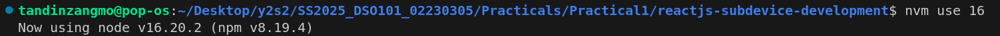
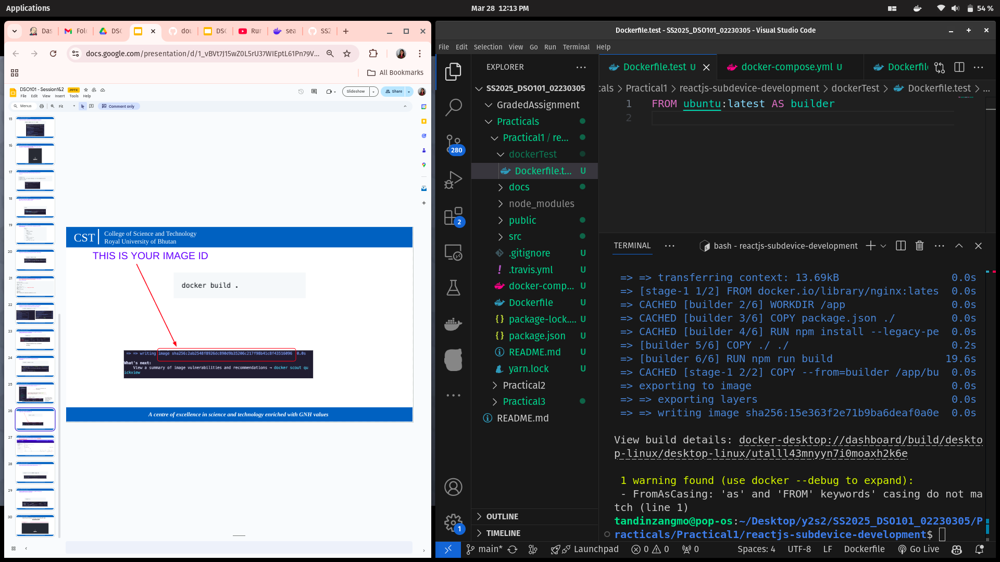

# Report On Docker Containerization

### Introduction

Docker is a platform which allows us to containerize application by packaging along with its dependencies into light weight unit called containers. This allows containers to run consistently across different environment.

### Objectives
 - Setup a environment called development environment using docker.
 - Understand docker containerization for a react application and implement it.
 - Create multi-stage build process.
 - Configure docker compose to manage multiple services.
 - Troubleshoot the issues in containerized applications.

## Steps
### Step 1 : Clone the repository

```sh
git clone https://github.com/TandinZangmo456/reactjs-subdevice.git
```

### Step 2 : Check Out the Development Branch
```sh
cd reactjs-subdevice-development
git checkout development
```

### Step 3 : Install npm and run application locally 
```sh
npm install
```

### Step 4 : Run locally 
```sh
npm start
```

Switch Node.js version if you get issues.
```sh
nvm use 16
```


### Step 5 : Build Docker Image
Build using the command given below:
```sh
docker build -f Dockerfile.test -t <User_ID>/<Image_name> .
```


### Step 7: Run the Docker Container
Run the docker container having port forwarding and volume mounting. After this check if the container is running or not.

```sh
docker run -d -p 3000:3000 -v /app/node_modules -v $(pwd):/app <user_name>/<image_name>

docker ps
```


To stop the container, we use 
```sh
docker stop <container_id>
```

### Step 8 : Create a Docker Compose File(docker-compose.yml file)


### Step 9 : Start the Docker Containers Using Docker Compose

```sh
docker compose up -d --build
```


### Step 10 : Run Tests in a Separate Container
Check the running containers and access it.

```sh
docker ps

docker exec -it <web_container_id> sh
```


### Step 11 : Add Test Service in Docker Compose
Modify the docker-compose.yml file to which it includes test service.

### Step 12 : Stop the container
```sh
docker compose stop
```

### Step 13 : Create a Multi-Stage Build Dockerfile
Create a new Dockerfile which will implements a multi-stage build process using different base image than before.


### Step 14 : Rebuild and Start the Docker Container with the Test Service
Rebuild it and start the container.

```sh
docker compose up -d --build
```


### Step 15 : Build the Multi-Phase Container Setup




### Step 16 : Start the Multi-Phase Container and Expose Ports


### 17 : Verify Running Container

```sh
http://localhost:80
```

