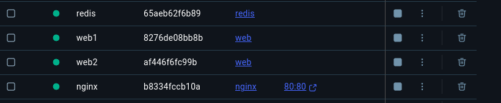

# Practicals 2: Docker Networking and container to container communication.

## Overview
The main objective of this practical is to implement multi-container application using Docker compose. This report includes setting up a simple multi-container application, configuring networking and make sure that the containers can communicate with other.

## Steps

### 1. Clone the repository

```sh
git clone https://github.com/dockersamples/nginx-node-redis
cd nginx-node-redis
```


### 2. Build docker images

```sh
cd nginx
docker build -t nginx .

cd ../web
docker build -t web .
```


### 3. Create a Docker Network

```sh
docker network create sample-app
```


### 4. Run the Containers

```sh
# Start Redis
docker run -d --name redis --network sample-app --network-alias redis redis

# Start the first Node.js container
docker run -d --name web1 -h web1 --network sample-app --network-alias web1 web

# Start the second Node.js container
docker run -d --name web2 -h web2 --network sample-app --network-alias web2 web

#Practical2report/images/8.png Start Nginx
docker run -d --name nginx --network sample-app -p 80:80 nginx
```


### 5. Verify the containers

```sh
docker ps
```


## Conclusion
The Docker compose tool simplifies multi-container application management through its compose.yml configuration file that enables users to define and configure every service. Using a single command (docker compose up) enables users to begin and link all containers instead of performing manual commands for individual containers. Complex application deployment needs this tool to reduce errors and save time and boost workflow efficiency thus becoming an essential management tool for enterprise applications. 