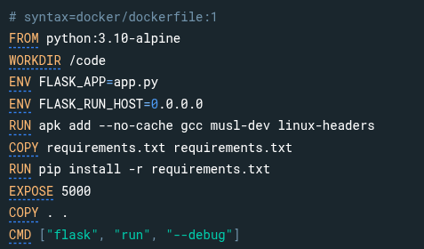
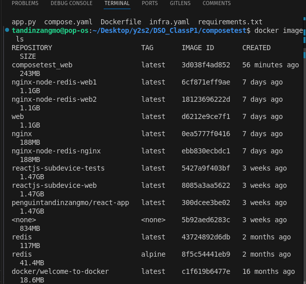

# Report On Docker Compose Quickstart

## Introduction

This report is on Docker Compose Quickstart in which it provides step by step guide on fundamental concepts of docker compose through development of simple python web application using flask framework and redis counter. It demostrates the core functionalities of Docker Compose.

## Steps 
### Step 1 : Set up
Create a project directory named composetest.

Set up necessary file like app.py, requirements.txt and Dockerfile.

### Step 2: Define Services in a Compose File
A compose.yaml file is created to define two services: web and redis.

### Step 3: Build and Run the App with Compose
Running docker compose up builds and starts the application.

We can verify the process application via a browser and observe the hit counter incrementing with each page refresh.

We can access it through http://localhost:8000

### Step 4: Edit the Compose File to Use Compose Watch
In here it introduces Compose Watch, a feature that automatically updates the running application when code changes are made.

### Step 5: Re-build and Run the App with Compose
After enabling Compose Watch, it needs to rebuild and run the application again. 

### Step 6: Update the Application
Modify the application code in app.py (e.g., changing the greeting message) and observe the changes reflected in real-time. 

### Step 7: Split Up Your Services
To demonstrate modularization, the guide instructs the user to split the compose.yaml file into multiple files (compose.yaml and infra.yaml).

### Step 8: Experiment with Other Commands
Run the service in the background and check.

## Conclusion
The Docker Compose Quickstart guide makes an effective tutorial for learning Docker Compose core concepts alongside its functionalities. This guide helps us learn about Compose functionality to develop and control a basic application with multiple containers which provides essential knowledge about workflow optimization including Compose Watch and modularization.

This help us expand knowledge on Docker. AS the tutorial serves as an excellent starting point for anyone who is looking to leverage Docker Compose in their development projects.
