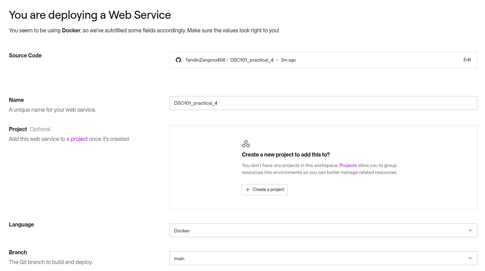

# Practical 3 Report: 
## Creating and pushing a pre-built docker image.

## Task 1 Process is written Step-by-Step 

### 1. Preparation of the application
For this practical, i have created a simple  Node.js:
- index.js

### 2. Create a Dockerfile

Create a file named `Dockerfile` 


### 3. Build the Docker Image

```sh
docker build -t yourdockerhubusername/simple-node-app:v1 .
```


### 4. Run the Container Locally

```sh
docker run -p 3000:3000 yourdockerhubusername/simple-node-app:v1
```


### 5. Push to DockerHub

```sh
docker tag simple-static-app penguintandinzangmo/simple-static-app:v1
docker push penguintandinzangmo/simple-static-app:v1
```

## Task 2 Deploy on render by github.

### 1. Push to your github.


### 2. Deploy the application and check whether it is working or not.




## URL of the deployed application.

https://dso101-practical-4.onrender.com