# Practical 4 Report on Jenkins Server for a git repository

## Objectives

The main objective of this practical was to setup jenkins server and implement CI/CD pipeline for a Node.js application. The process involves setting up jenkins with the necessary plugins, configuring Node.js and integrating the git-based workflow on the application. 

## Steps Involved
### 1. **Installation of plugins** 
- NodeJS Plugin (for Node.js tool auto-installation).
- Git Plugin (for SCM integration).
- Pipeline Plugin (for defining pipelines as code).

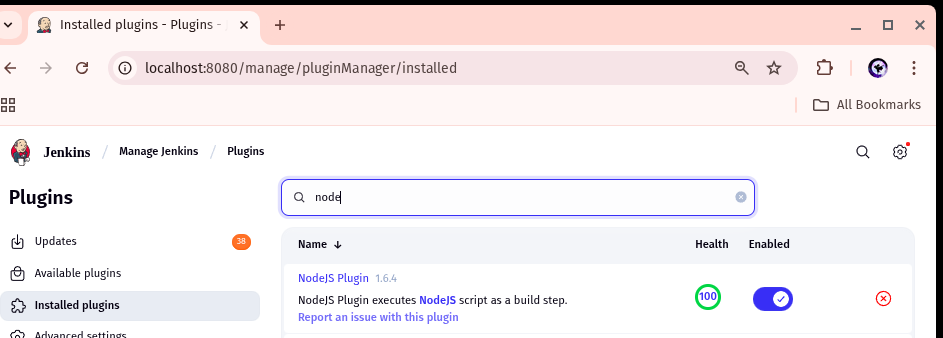

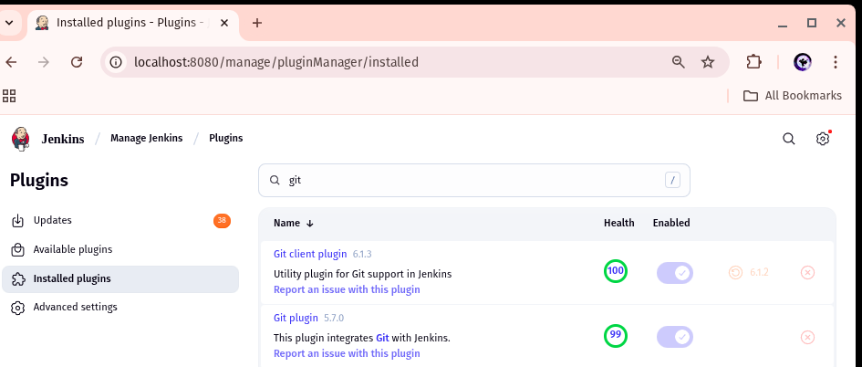

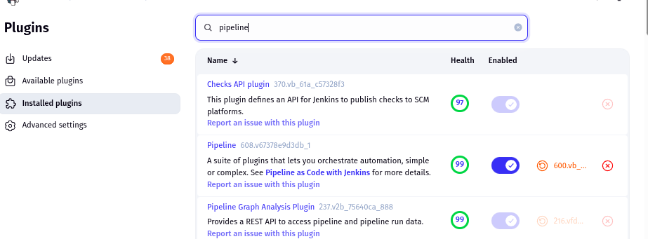

### 2. **Node.js tool configuration** 
Configured Node.js in Jenkins Global Tool Configuration by specifying the version of Node.js and enabling automatic installation, ensuring the pipeline could use the required runtime.

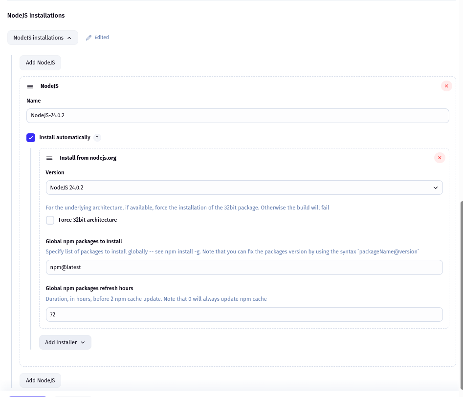

### 3. **Create Node.js Application** 

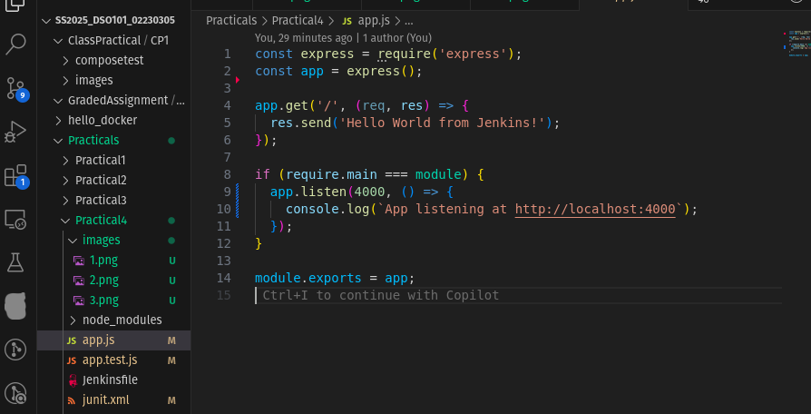

### 4. **Create jenkins pipeline job** 

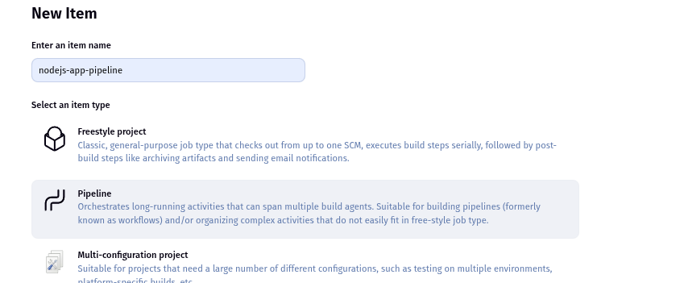

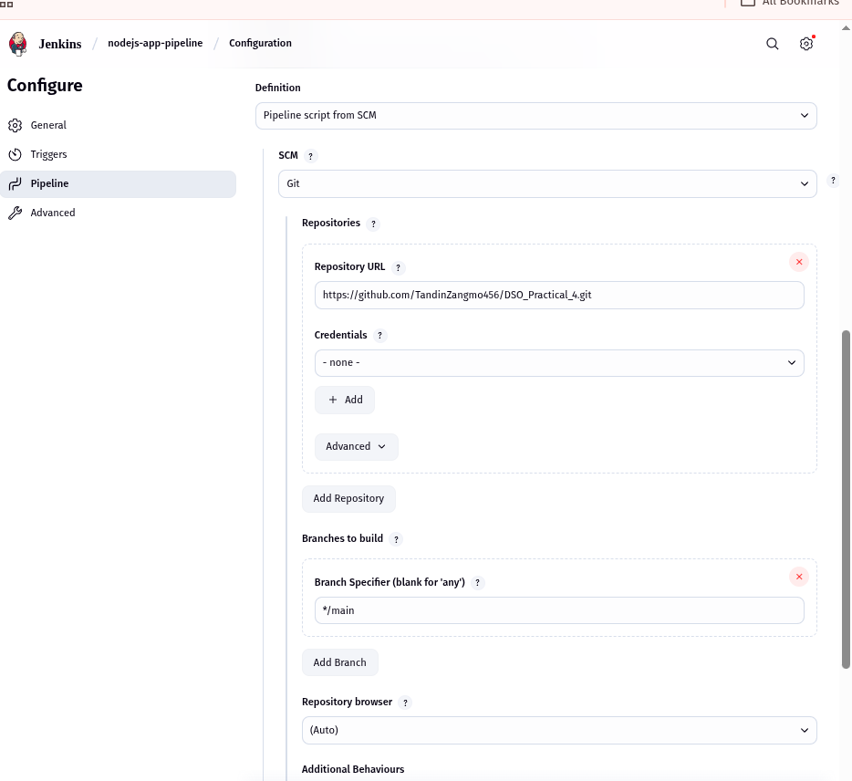

### 5. **Run the pipeline** 

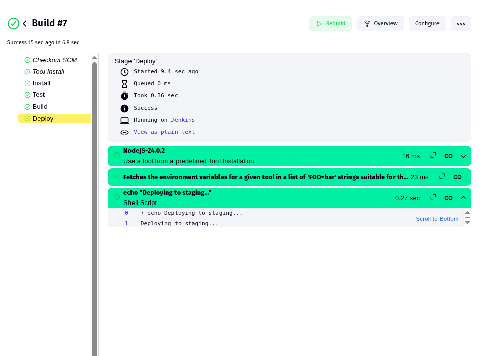

## Challenges Faced and Solutions
- **Challenge:** Jenkins couldn't find a test report because jest-junit wasn't configured.

    - **Solution:** 
    

- **Challenge:** Test failed because it was trying to use a server object that wasn’t exported from app.js.

    - **Solution:** 
    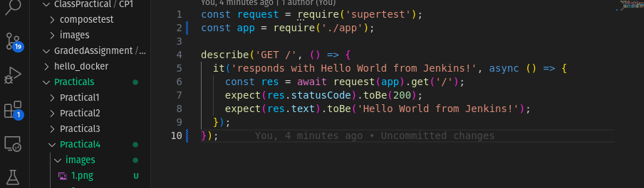

- **Challenge:** Jenkins couldn't find the correct NodeJS tool, or junit.xml might not be archived.
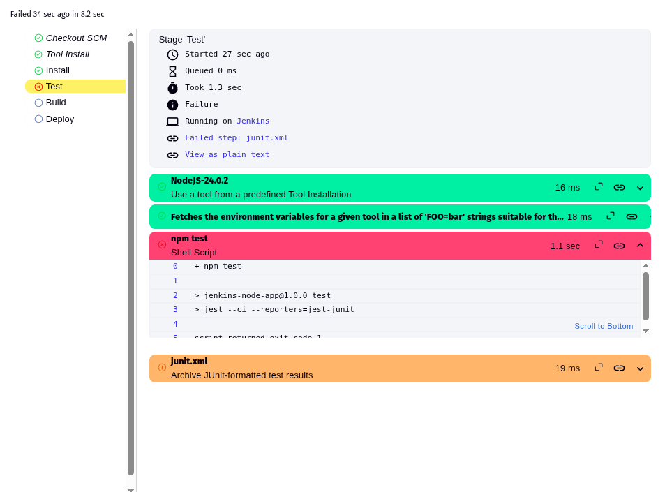
    - **Solution:** 
    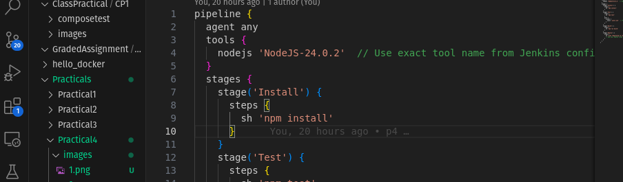

## Conclusion
In this practical 4, i implemented jenkins CI/CD pipeline for a node.js application successfully. It can run test, generate test reports, build application and deploy it whenever there is changes made in the repository ensuring streamlined and reliable CI/CD process.