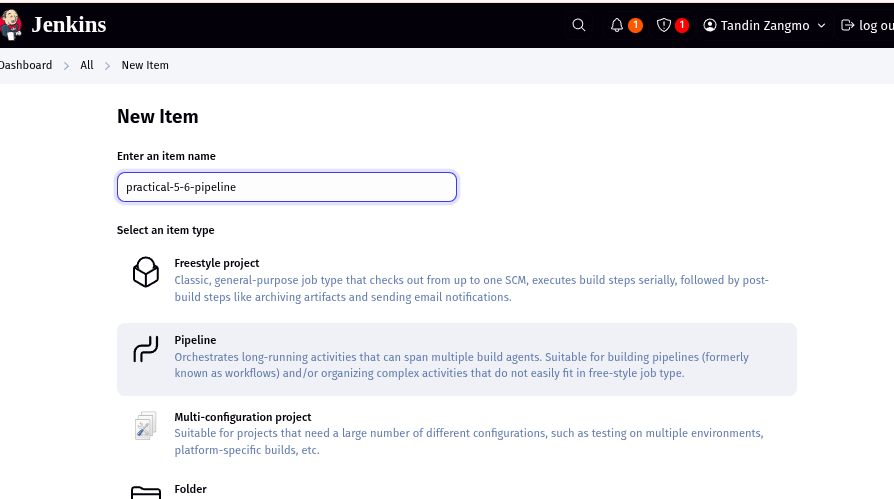
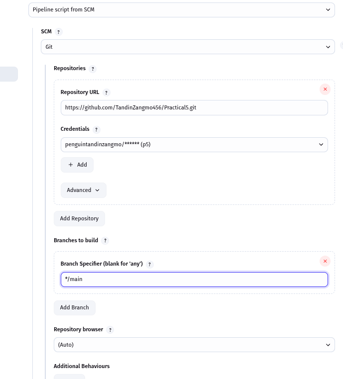
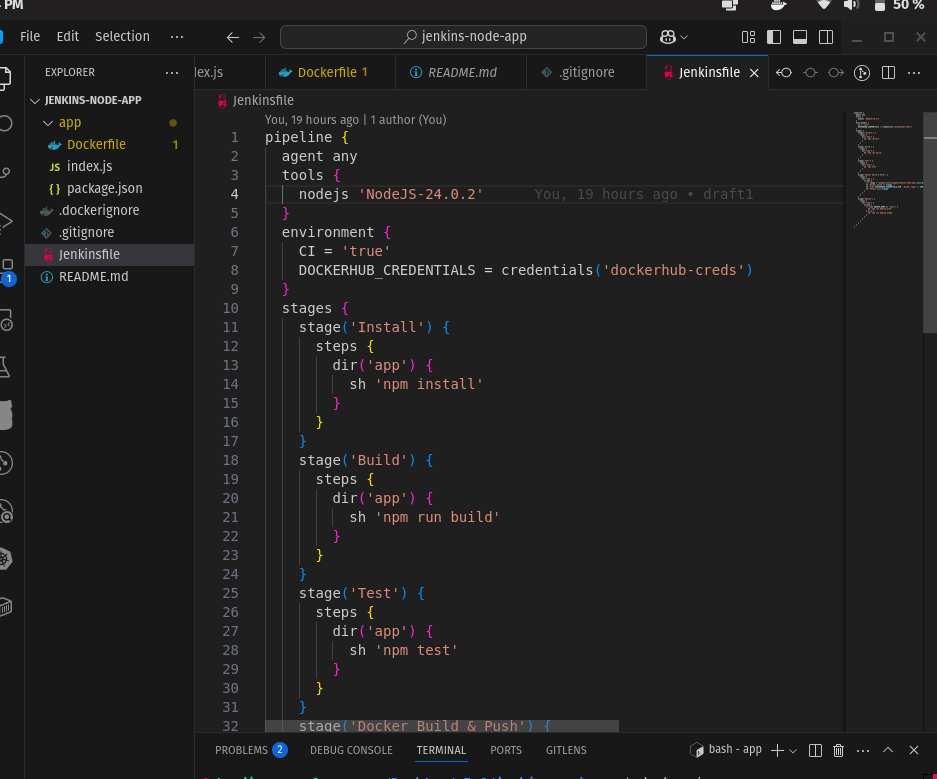
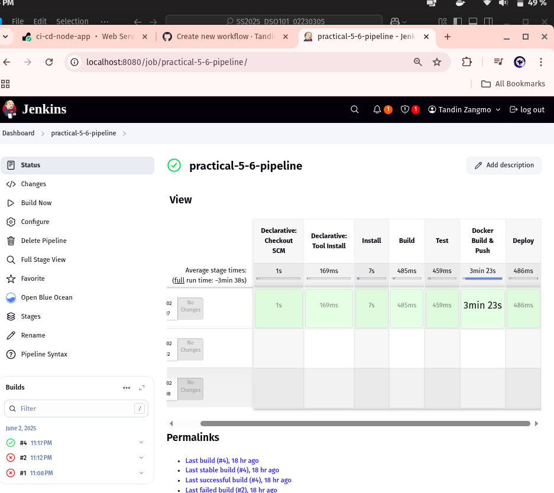
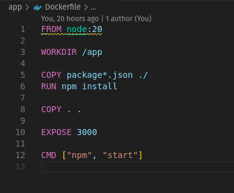
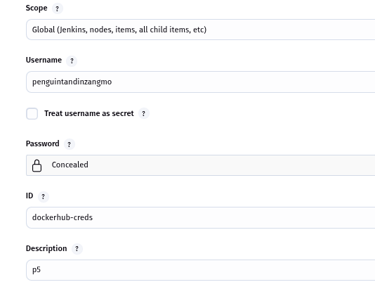
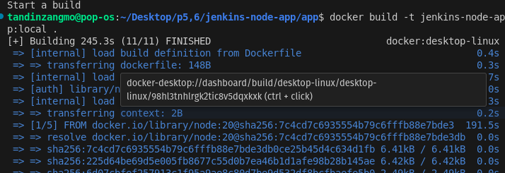
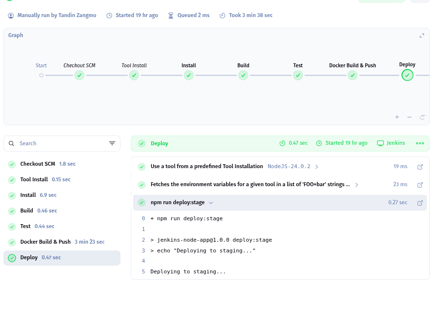

# Practical 5 & 6 Report: Declarative pipeline for Jenkins and using external services


## Objective
The objective of this practical is to show how to build jenkins to handle build, test and deployment of Node.js application by using declarative pipeline. The purpose is to move the process further by creating and delivering a Docker image securely using Jenkins secrets. The aim is to have CI/CD processes run automatically.

## Step by step methods.

### Phase 1: Node.js Application

Creating the NodeJS application

```sh
{
  "scripts": {
    "start": "node index.js",
    "test": "echo \"Running tests...\" && exit 0",
    "build": "echo \"Build complete\"",
    "deploy:prod": "echo \"Deploying to production...\"",
    "deploy:stage": "echo \"Deploying to staging...\""
  }
}
```

### Phase 2: Jenkins Configuration
1. Installed the required plugins from the previous practical.

2. Done Setting up Node.js 24.0.2 in Global Tool Configuration from the previous practical.

3. Create Pipeline job

 
Configure SCM: Git repository URL

Set Script Path: Jenkinsfile



### Phase 3: Jenkinsfile Creation

Basic Pipeline structure



Run pipeline in jenkins

Successsfully ran after the 4th attempt.



Part 2

1. Created Dockerfile



2. Configured Docker Hub Credentials



3. Local testing



4. Run jenkins



## Challenges Faced

| Challenge                     | Solution                                                                 |
|------------------------------|--------------------------------------------------------------------------|
| Docker image push failed     | Used dockerhub-creds via credentials() block in Jenkinsfile       |
| NodeJS tool not found	 | Matched tool name exactly in Jenkinsfile and Global Tool |
| Test stage skipped JUnit report	  | Simplified test with echo and skipped JUnit to avoid errors |

## Conclusion

From doing this practical, I was able to learn how to build a fully integrated CI/CD pipeline with Jenkins for Node.js apps. I discovered ways to make the steps of installing dependencies, building, testing, making Docker images and pushing them to Docker Hub automatic. I gained more skills in using Jenkins pipelines, adding Docker and handling secure credentials.

