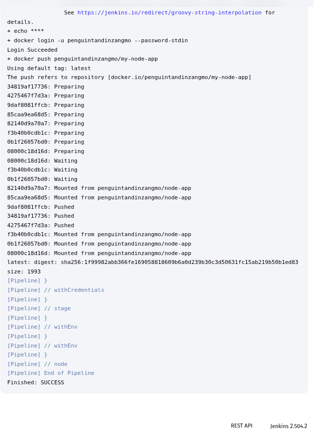

# Practical 7: Jenkins Shared Library for Node.js Applications

## Objective
This practical was mainly done to implement a Jenkins Shared Library to centralize and reuse common pipeline logic across multiple Node.js projects. The shared library automates standard CI/CD steps such as:

- Installing Node.js dependencies
- Running tests
- Building Docker images
- Pushing images to DockerHub

By using a shared library, the pipeline becomes more maintainable and reusable across projects which improves consistency.

## Steps Involved
### 1. Create a Shared Library Repository
- Created a new GitHub repository: jenkins-shared-lib.

### 2. Create a Node.js Application Repository

### Step 3: Create and Configure Node.js App

### Step 4: Create Jenkinsfile

Final result:

## Conclusion

This practical demonstrated how to:

- Create a modular Jenkins Shared Library

- Set up a complete CI/CD pipeline for a Node.js project

- Automate common steps like install, test, build, and Docker push

- Reuse pipeline logic across multiple projects with minimal duplication

# Repository Links

https://github.com/TandinZangmo456/shared-libs.git

https://github.com/TandinZangmo456/my-node-app.git
