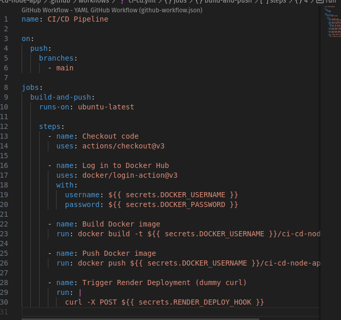

# Implementation of CI/CD Pipeline with GitHub Actions, Docker Hub, and Render

## Objective
This practical implements a complete CI/CD workflow using GitHub Actions. The process includes:

- Creating a Node.js application
- Dockerizing the application
- Automatically building and pushing Docker images to Docker Hub on every code push
- Triggering automatic deployment of the application to Render.com using deploy hooks

## Steps Involved

### 1. Create the Node.js App
- A basic server.js was created.
- It serves a simple message on the root URL.

### 2. Dockerize the App
Created a Dockerfile 

### 3. Set Up GitHub Actions
A `.github/workflows/ci-cd.yml` workflow was created.

### Step 5: Set Up GitHub Secrets
Go to GitHub Repository > Settings > Secrets > Actions and add:

DOCKER_HUB_USERNAME – your Docker Hub username

DOCKER_HUB_TOKEN – Docker Hub access token (create under Docker Hub > Account Settings > Security)

### Step 6: Set Up Render.com Deployment

## Conclusion

This practical provided hands-on experience with implementing a complete CI/CD pipeline using modern DevOps tools. By connecting GitHub, Docker Hub, and Render, the deployment process was fully automated, reducing manual steps and ensuring code changes are quickly delivered to production. This exercise helped build a strong foundational understanding of continuous integration and deployment workflows.

